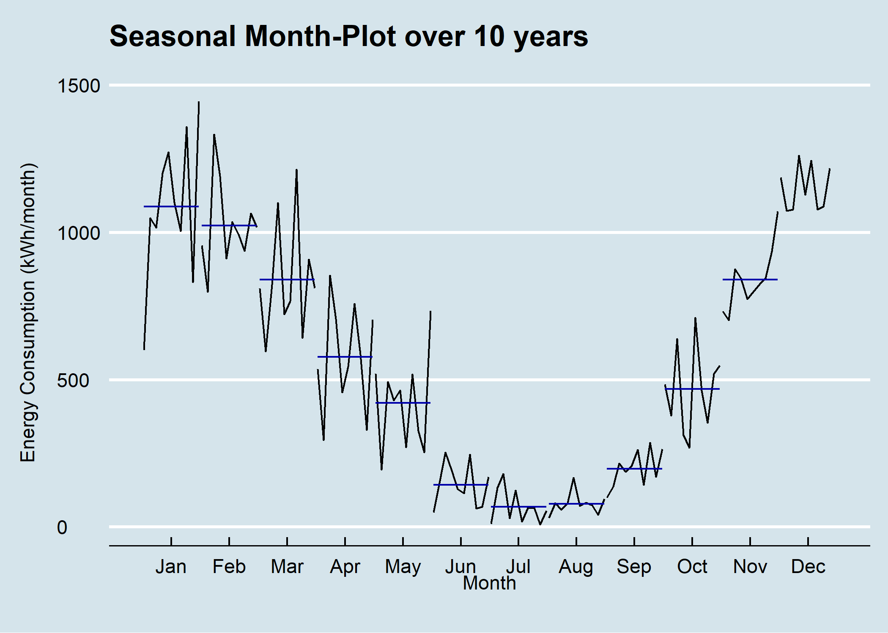

## Seasonal Plot - Monthplot
### Task


```{r out.width='70%', fig.cap='Seasonal Plot x/y per Month over 10 Years', echo=FALSE}

```

### Basis

### Solution
```{r seasonalPlotMonth1, warning=FALSE, message=FALSE, collapse = FALSE}
library(forecast)
library(dplyr)
library(plotly)
library(htmlwidgets)
library(ggthemes)
library(viridis)
library(lubridate)

# load csv file
df <- read.csv2("https://github.com/hslu-ige-laes/edar/raw/master/sampleData/flatHeatAndHotWater.csv",
                stringsAsFactors=FALSE)

# filter flat
df <- df %>% select(timestamp, Adr01_energyHeat)

colnames(df) <- c("timestamp", "meterValue")

# calculate consumption value per month
# pay attention, the value of 2010-02-01 00:00:00 represents the meter reading on february first,
# so the consumption for february first is value(march) - value(february)!
df <- df %>% mutate(value = lead(meterValue) - meterValue)

# remove counter value column
df <- df %>% select(-meterValue)

# value correction (outlier because of commissioning)
df[1,2] <- 600

# create time series object for ggmonthplot function
df.ts <- ts(df[-1], frequency = 12, start = min(year(df$timestamp)))

# create x/y plot

numYears = length(unique(year(df$timestamp)))

plot <- ggmonthplot(df.ts,
                    col = viridis(numYears),
                    main = "Seasonal Month-Plot over 10 years\n",
                    ylab = "Energy Consumption (kWh/month)\n",
                    xlab = "Month\n "
                    )

# change theme (optional)
plot <- plot + ggthemes::theme_economist()

# make plot interactive (optional)
plotly <- plotly::ggplotly(plot)

# show plot
plotly
```

```{r seasonalPlotMonth2, warning=FALSE, message=FALSE, collapse = FALSE}
# save static plot as png
ggsave("images/plotSeasonalMonth.png", plot)
```

```{r seasonalPlotMonth3, eval=FALSE}
# save interactive plot as html
library(htmlwidgets)
htmlwidgets::saveWidget(plotly, "plotlySeasonalMonth.html")
```

### Discussion


