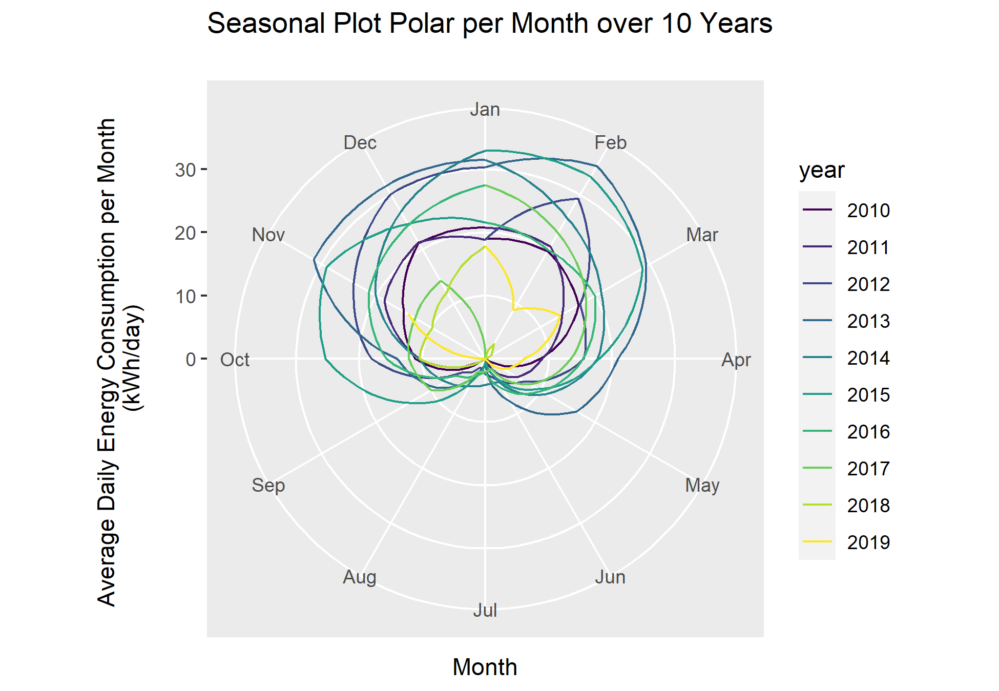

## Seasonal Plot - Polar
### Goal
Plot a seasonal plot as described in <a href="https://otexts.com/fpp2/seasonal-plots.html" target="_blank">Hyndman and Athanasopoulos (2014, chapter 2.4)</a>:

```{r out.width='70%', fig.cap='Seasonal Plot Polar per Month over 10 Years', echo=FALSE}

```

This is like an overlapping time series plot which uses polar coordinates. Be aware that seasons in this context don't correlate with the seasons of the year.

### Data Basis
In general, the values of energy meters, as in our example, increase steadily:

```{r seasonalPlotPolar00, warning=FALSE, message=FALSE, collapse = FALSE, echo=FALSE, fig.cap='Raw Data for Seasonal Plot Polar'}
library(dplyr)
library(lubridate)
df <- read.csv2("https://github.com/hslu-ige-laes/edar/raw/master/sampleData/flatHeatAndHotWater.csv",
                stringsAsFactors=FALSE)

# filter flat
df <- df %>% select(timestamp, Adr02_energyHeat) %>% na.omit()
df[1,2] <- 1676
df$timestamp <- parse_date_time(df$timestamp, "YmdHMS", tz = "Europe/Zurich")

# plot data
plot(df$timestamp, df$Adr02_energyHeat,
     xlab="Time", ylab="Meter value (kWh)", main="Monthly Raw Data")
```

### Solution
Create a new script, copy/paste the following code and run it:

```{r seasonalPlotPolar1, warning=FALSE, message=FALSE, collapse = FALSE}
library(forecast)
library(dplyr)
library(plotly)
library(htmlwidgets)
library(ggthemes)
library(viridis)
library(lubridate)

# load csv file
df <- read.csv2("https://github.com/hslu-ige-laes/edar/raw/master/sampleData/flatHeatAndHotWater.csv",
                stringsAsFactors=FALSE)

# filter flat
df <- df %>% select(timestamp, Adr02_energyHeat)

colnames(df) <- c("timestamp", "meterValue")

# calculate consumption value per month
# pay attention, the value of 2010-02-01 00:00:00 represents the meter reading on february first,
# so the consumption for february first is value(march) - value(february)!
df <- df %>% mutate(value = lead(meterValue) - meterValue)

# remove counter value column
df <- df %>% select(-meterValue)

# value correction (outlier because of commissioning)
df[1,2] <- 600

df.ts <- ts(df %>% select(value) %>% na.omit(), frequency = 12, start = min(year(df$timestamp)))

# create polar plot

numYears = length(unique(year(df$timestamp)))

plot <- ggseasonplot(df.ts,
                     col = viridis(numYears),
                     main = "Seasonal Plot Polar per Month over 10 Years\n",
                     ylab = "Energy Consumption (kWh/month)",
                     polar = TRUE
                     )

# show plot (interactive version with plotly unfortunately not possible)
plot

```

```{r seasonalPlotPolar2, warning=FALSE, message=FALSE, collapse = FALSE}
# save static plot as png (optional)
ggsave("images/plotSeasonalPolar.png", plot)
```

### Discussion
This representation emphasizes the high consumption in summer very well, which could undoubtedly be reduced in a residential building. The Years 2018 and 2019 show, that this optimization was done.

To emphasize this optimization please refer to the next chapter \@ref(dataVisSeasonalBefAft).


