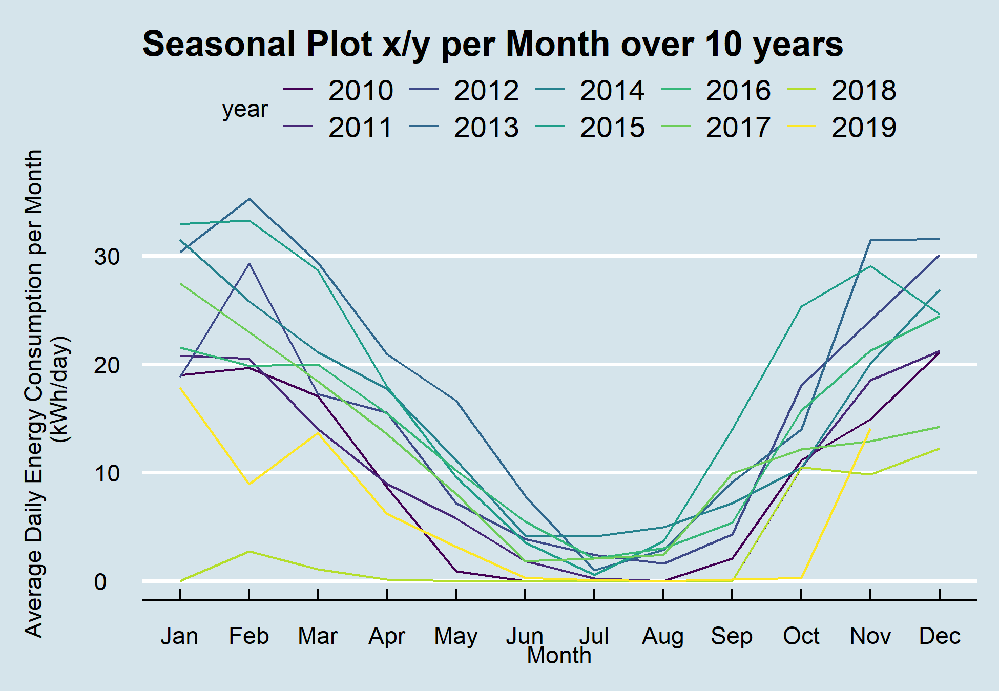

## Seasonal Plot - x/y
### Task
Plot a seasonal plot as described in Hyndman and Athanasopoulos (2014, chapter 2). This is like a time plot except that the data are plotted against the seasons in separate years.
Something like a time plot except that the data from each month are
overlapped.
Enables the underlying seasonal pattern to be seen more clearly, and
also allows any substantial departures from the seasonal pattern to
be easily identified.


```{r out.width='70%', fig.cap='Seasonal Plot x/y per Month over 10 Years', echo=FALSE}

```

### Basis

### Solution
```{r seasonalPlotXY1, warning=FALSE, message=FALSE, collapse = FALSE}
library(forecast)
library(dplyr)
library(plotly)
library(htmlwidgets)
library(ggthemes)
library(viridis)
library(lubridate)

# load csv file
df <- read.csv2("https://github.com/hslu-ige-laes/edar/raw/master/sampleData/flatHeatAndHotWater.csv",
                stringsAsFactors=FALSE)

# filter flat
df <- df %>% select(timestamp, Adr02_energyHeat)

colnames(df) <- c("timestamp", "meterValue")

# calculate consumption value per month
# pay attention, the value of 2010-02-01 00:00:00 represents the meter reading on february first,
# so the consumption for february first is value(march) - value(february)!
df <- df %>% mutate(value = lead(meterValue) - meterValue)

# remove counter value column
df <- df %>% select(-meterValue)

# value correction (outlier because of commissioning)
df[1,2] <- 600

# create time series object for ggseanplot function
df.ts <- ts(df %>% select(value) %>% na.omit(), frequency = 12, start = min(year(df$timestamp)))

# create x/y plot

numYears = length(unique(year(df$timestamp)))

plot <- ggseasonplot(df.ts,
                     col = viridis(numYears),
                     main = "Seasonal Plot x/y per Month over 10 years",
                     ylab = "Energy Consumption (kWh/month)"
                     )

# change theme (optional)
plot <- plot + ggthemes::theme_economist()

# make plot interactive (optional)
plotly <- plotly::ggplotly(plot)

# show plot
plotly
```

```{r seasonalPlotXY2, warning=FALSE, message=FALSE, collapse = FALSE}
# save static plot as png
ggsave("images/plotSeasonalXY.png", plot)
```

```{r seasonalPlotXY3, eval=FALSE}
# save interactive plot as html
library(htmlwidgets)
htmlwidgets::saveWidget(plotly, "plotlySeasonalXY.html")
```

### Discussion


