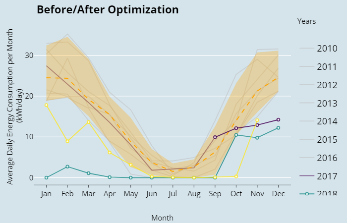

## Seasonal Plot - x/y Before/After
### Task
```{r out.width='70%', fig.cap='Seasonal Plot x/y Before/After', echo=FALSE}

```

### Basis

### Solution
```{r energyConsBeforeAfter1, warning=FALSE, message=FALSE, collapse = FALSE}
library(redutils)
library(dplyr)
library(plotly)
library(htmlwidgets)
library(ggthemes)

# load csv file
df <- read.csv2("https://github.com/hslu-ige-laes/edar/raw/master/sampleData/flatHeatAndHotWater.csv",
                stringsAsFactors=FALSE)

# filter flat
df <- df %>% select(timestamp, Adr02_energyHeat)

colnames(df) <- c("timestamp", "meterValue")

# calculate consumption value per month
# pay attention, the value of 2010-02-01 00:00:00 represents the meter reading on february first,
# so the consumption for february first is value(march) - value(february)!
df <- df %>% mutate(value = lead(meterValue) - meterValue)

# remove counter value column
df <- df %>% select(-meterValue)

# create plot
plot <- plotSeasonalXYBeforeAfter(df,
                                  dateOptimization = "2017-09-01",
                                  locTimeZone = "Europe/Zurich",
                                  main = "Before/After Optimization",
                                  ylab = "Energy Consumption \n(kWh/month)"
                                  )

# change theme (optional)
plot <- plot + ggthemes::theme_economist()

# make plot interactive (optional)
plotly <- plotly::ggplotly(plot)

# show plot
plotly
```

```{r energyConsBeforeAfter2, warning=FALSE, message=FALSE, collapse = FALSE}
# save static plot as png
ggsave("images/plotSeasonalXYBeforeAfter.png", plot)
```

```{r energyConsBeforeAfter3, eval=FALSE}
# save interactive plot as html
library(htmlwidgets)
htmlwidgets::saveWidget(plotly, "plotlySeasonalXYBeforeAfter.html")
```

### Discussion


